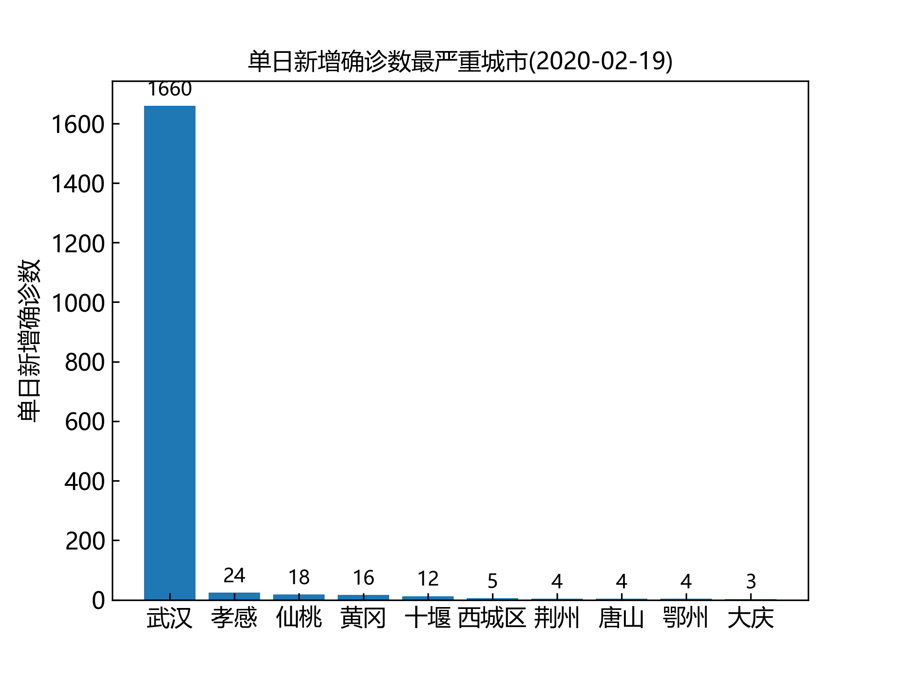
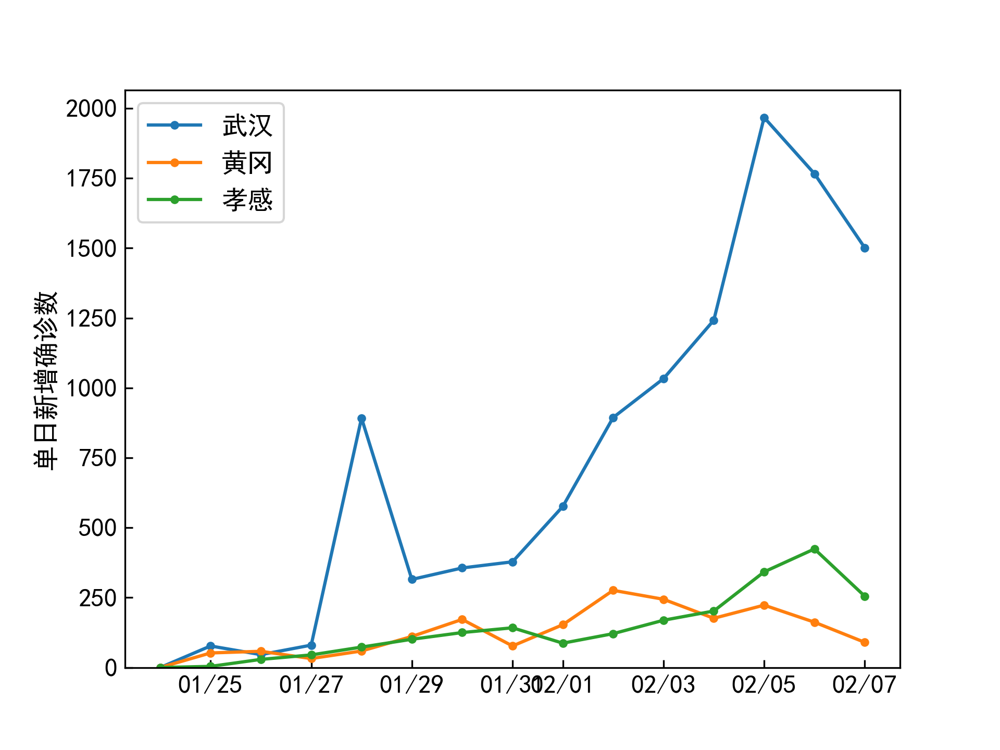
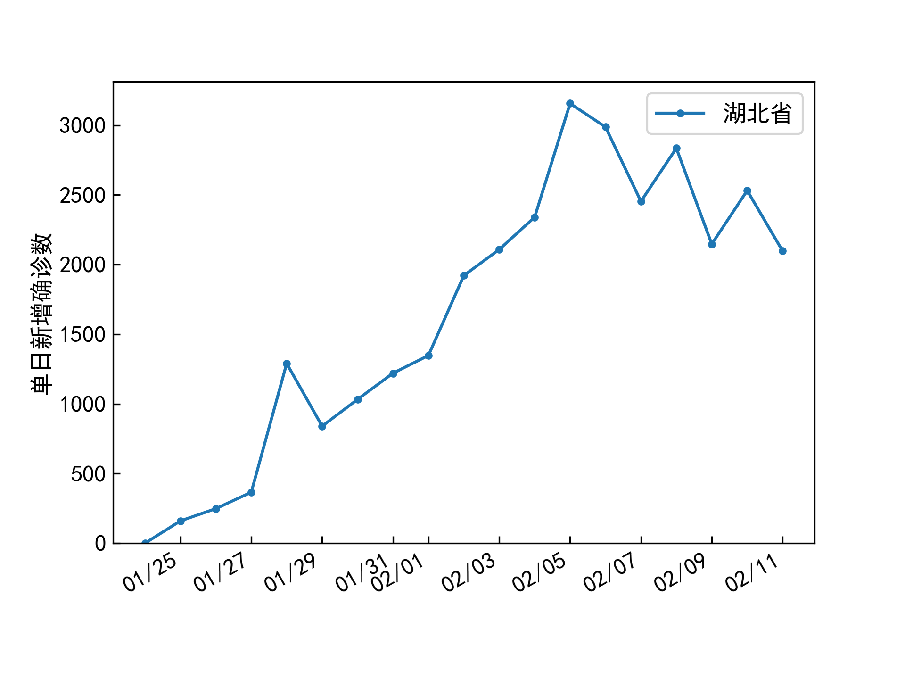
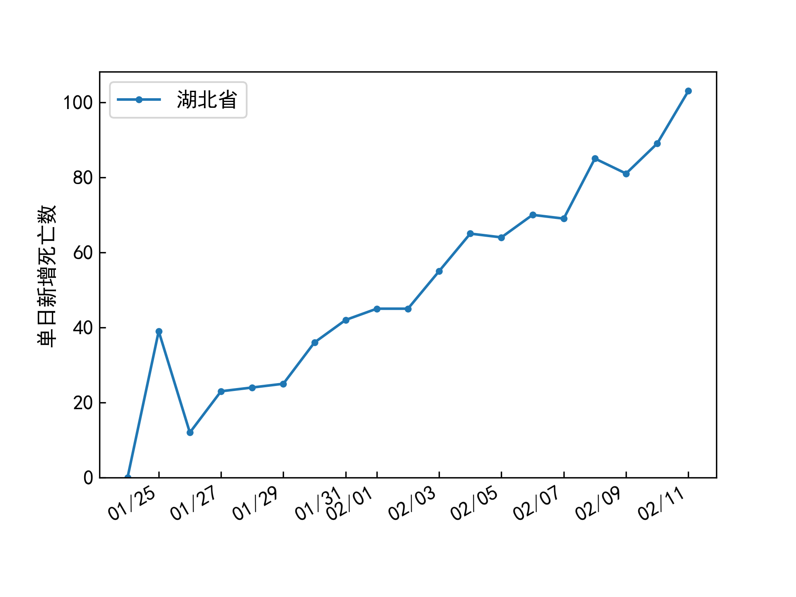
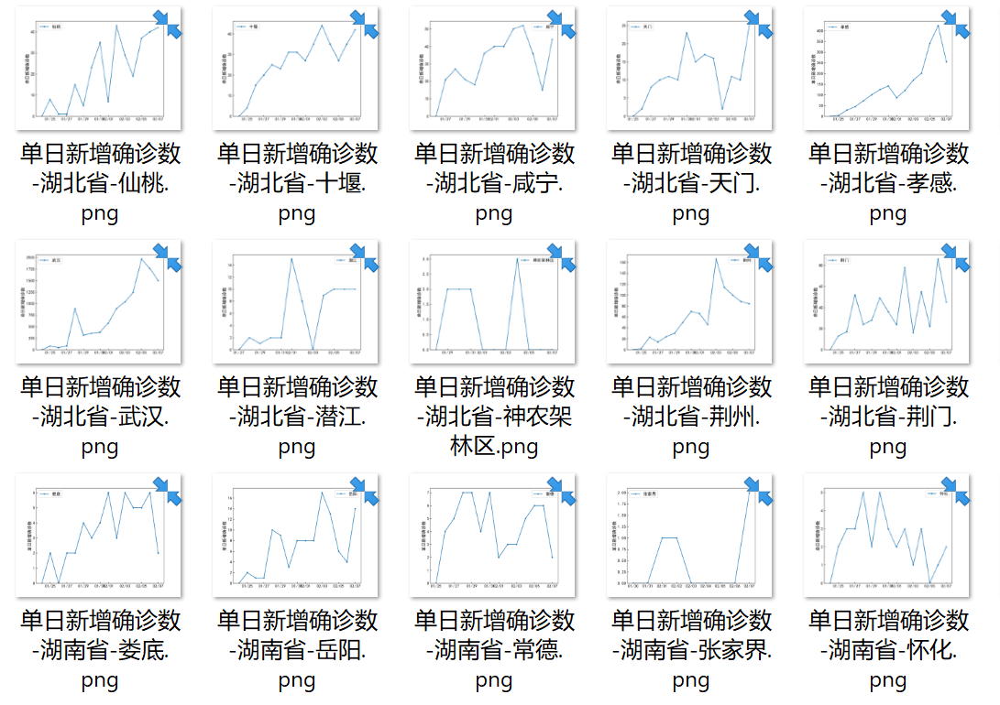

# VisualizeDXYArea
## 用途 | Purpose
将 *BlankerL* 提供的[2019新型冠状病毒疫情时间序列数据仓库](https://github.com/BlankerL/DXY-COVID-19-Data)进行可视化。目前为自用，可提供市级的确诊数、治愈数、死亡数时程线，（各大网站只提供全国确诊数的时程线）。
目前提供中文、英文两种输出。

注意本项目使用的是**丁香园（DXY）的国内数据**。

若对**全球趋势**感兴趣，可参见另一个项目（也是本项目的一个重写）：https://github.com/lyupin/plot-timehistory-open-covid-19 

也可参考下面所附的其它英文链接。

Visualize the time-history of important daily counts in COVID-19 **in China**.
The data is stored in another author's repository: https://github.com/BlankerL/DXY-COVID-19-Data ,
which is gathered by the website Ding Xiang Yuan focusing on epidemic situation in China.

This visualization script is **not** for COVID-19 **worldwide**. 

**If you are looking for data and visualization outside of China, maybe you can try these**:
* My another repository for worldwide COVID-19 timehistory: https://github.com/lyupin/plot-timehistory-open-covid-19
* GIS for worldwide situation provide by JHU: https://gisanddata.maps.arcgis.com/apps/opsdashboard/index.html#/bda7594740fd40299423467b48e9ecf6
* North America visualization provided by "一亩三分地": https://coronavirus.1point3acres.com/
* Worldwide data and visualization compiled by Chinese media ThePaper.cn: https://github.com/839-studio/novel-coronavirus-updates

However, the features are quite limited by now as it is for my personal use. (I live in the epicenter of the pandemic, Wuhan City, Hubei Province. I care about the trend.)

The daily increment will be calculated and plotted so that we are aware of the trend.

The data is provided by *BlankerL* at his repository [DXY-COVID-19-Data](https://github.com/BlankerL/DXY-COVID-19-Data).







## 用法 | Usage
打开`VisualizeDXYArea.py`，填入语种、感兴趣的省名、市名、数据文件的路径，保存后，运行

Open `VisualizeDXYArea.py`, fill the language, the names of interested cities or provinces, save and run:

```
python VisualizeDXYArea.py
```
将生成`png`格式的时程线图片。

Time-histories will be saved as figures in format of `png`.

## 依赖库 | Dependencies
除标准`python`库外，需额外安装的库有：

Besides the standard `python 3` library, you need these libs installed: 

`matplotlib pandas`